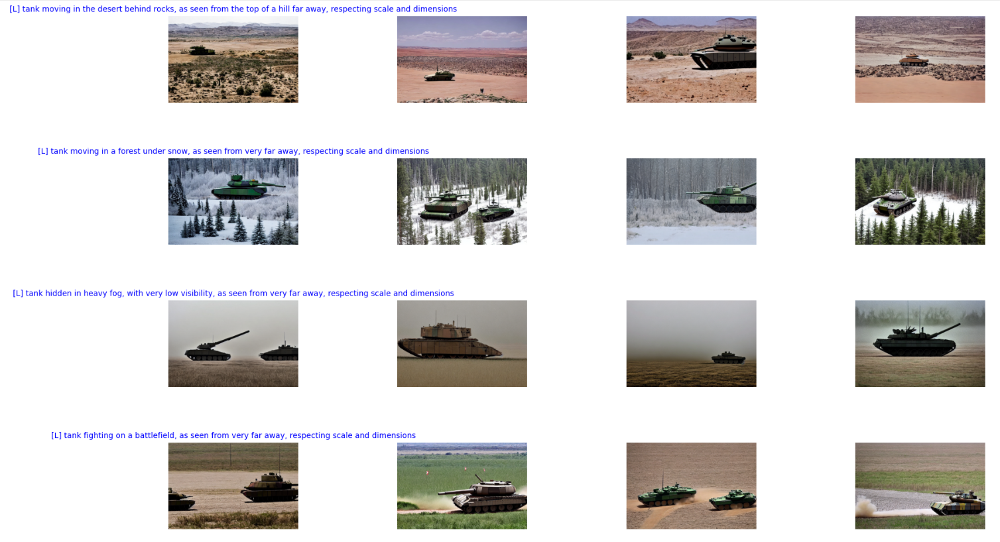

# Automated Detection of Military Vehicles from Video Input (ADOMVI)

<div align="center">
  
</div>

## Introduction

This repository contains notebooks and resources used to train a state-of-the-art military vehicle tracker. Its main focus is on building a dataset of relevant images and annotations to fine-tune pre-trained object detection models, namely a [Yolov8](https://github.com/ultralytics) model.

We start by building a training dataset from images available in open source object detection datasets (ImageNet, OpenImages, Roboflow). We also use scraping tools to collect more images of military vehicles from Google images. This allows us to define four broad classes of military vehicles that our model can then discriminate: **Armoured Fighting Vehicle (AFV)**, **Armoured Personnel Carrier (APC)**, **Military Engineering Vehicle (MEV)** and **Light Armoured Vehicle (LAV)**. We provide a [sample annotated dataset](https://github.com/jonasrenault/adomvi/releases/tag/v1.2.0) for these classes.

We also explore using [diffusion models](https://huggingface.co/docs/diffusers/using-diffusers/conditional_image_generation) and the [dreambooth](https://huggingface.co/docs/diffusers/training/dreambooth) method to generate new training images in different scenes and conditions.

## Contents

- The [adomvi](./adomvi/) directory contains utility functions to fetch and format datasets for training a Yolov8 model for object detection.
- The [resources](./resources/) directory contains video samples for vehicle detection task.
- The [notebooks](./notebooks/) directory contains exemple notebooks on how to
  1. [Prepare](./notebooks/01_Prepare.ipynb) a custom dataset of images annotated for automatic detection of military vehicles.
  2. [Train](./notebooks/02_Train.ipynb) train a Yolov8 model using the prepared dataset.
  3. Run [tracking](./notebooks/03_Track.ipynb) using the trained model on a sample video.
  4. Fine tune [Dreambooth](./notebooks/04_DreamboothFineTuning.ipynb) to generate images of a tank.

## Installation

To install the project, clone the repository and install the project in a python environment, either using `pip`

```console
git clone git@github.com:jonasrenault/adomvi.git
cd adomvi
pip install --editable .
```

or using [poetry](https://python-poetry.org/)

```console
git clone git@github.com:jonasrenault/adomvi.git
cd adomvi
poetry install
```

## Run the notebooks

To run the notebooks, start a jupyter lab server with

```console
jupyter lab
```

and open one of the notebooks in the `notebooks` directory.


## Tracking of military vehicles with multi-class object detection model

Some sample results of tracking different types of military vehicles (AFV, APC, MEV, LAV) using a finetuned yolov8-large model.

<div align="center">
  
  
  
</div>

## Generating diversity in our training dataset using Stable Diffusion and dreambooth

<div align="center">
  
</div>
